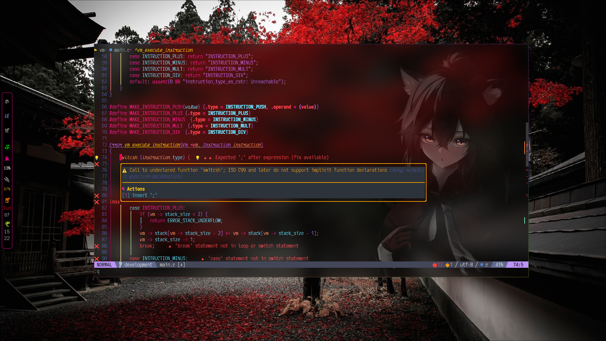

## Nvim with suport LSP
<!---->


## Plugins Used ⚙️
🟡 **LSP Saga** -- LSP Saga UIs<br>
🟡 LSP Kind -- Vscode-like pictograms<br>
🟡 Telescope<br>
🟡 Lua Line<br>
🟡 LSP Config -- Language server protocol<br>
🟡 CMP Buffer  -- Nvim-cmp source for buffer words<br>
🟡 CMP Nvim -- Nvim-cmp source for neovim's built-in LSP<br>
🟡 Buffer<br>
🟡 Indetline<br>
🟡 Wev Dev Icons<br>
🟡 Lua Snip -- Lua Snippet<br>
🟡 Auto Pairs -- Set autopairs<br>
🟡 Tree Sitter<br>
🟡 Smoth Cursor<br>
🟡 Plenary<br>
🟡 Telescope File Browser<br>
🟡 Ofirkai -- Dark theme based on monokai<br>
🟡 nvim-notify<br>
🟡 gitsigns<br>
🟡 Satellite Custom scrollbar for neovim<br>
🟡 vim-floaterm<br>
🟡 mason<br>
🟡 mason-lspconfig<br>
🟡 Null-ls<br>
🟡 Nvim-dap<br>

## Advantages and Disadvantages ⚠️
🟢 Higher productivity<br>
🟢 Extremely fast and lightweight<br>
🟢 Very beautiful<br>
🔴 Large learning curve<br>
🔴 Increased keyboard usage<br>
🔴 Complex Configuration<br>
🔴 High setup time<br>

## Basic Structure
```lua
nvim/
  |
  +--- After/plugin/
  |             |
  |             +-- foo.rc.lua \
  |                             +-- Example of a plugin configuration file
  |             +-- bar.rc.lua /
  |
  +--- init.lua --Common Vim API
  |
  +--- lua/
  |     |
  |     +--- base.lua       -- Base Configurations
  |     +--- highlights.lua -- Base theme settings
  |     +--- maps.lua       -- Keymaps
  |     +--- plugins        -- List of all installed plugins
  |
  +--- plugins/
          |
          +--- lspconfig.lua
          +--- lspkind.lua
          +--- lspsaga.lua
          +--- mason.rc.lua
          +--- null-ls.rc.lu
  
```
```sh
$ ls nvim/
$ after init.lua lua plugins
```

## Instalition guide
Wiki in construction
